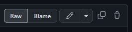
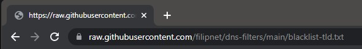

# dns-filters
Ad filters for use with PiHole or AdGuard

These filter lists can be used with PiHole or AdGuard, for this ...
* click on the corresponding blacklist/blocklist or whitelist
* use the "RAW" option in the menu

* copy the link from the browser and paste it into PIHole or AdGuard

## LICENSE

dns-filters and all individual scripts are under the BSD 3-Clause license unless explicitly noted otherwise. Please refer to the LICENSE
